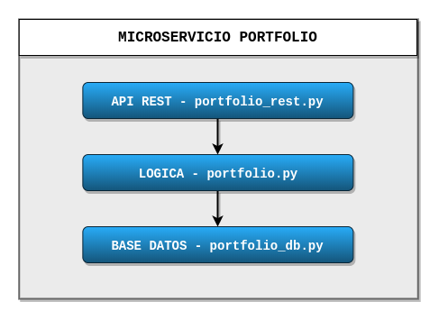

# Proyecto para la asignatura Cloud Computing

[](http://perso.crans.org/besson/LICENSE.html)
[](https://github.com/Solano96/CC-Project-Trading)
[](https://codecov.io/gh/Solano96/CC-Project-Trading)

## Descripción

En este proyecto se va a crear una aplicación desplegable en la nube, que sirva de simulador de bolsa.  Esta aplicación permitirá crear ordenes de compra y venta en el mercado y poder llevar un registro de la cartera del usuario.

### Arquitectura

La aplicación tendrá una arquitectura basada en microservicios. Para ver una descripción de la arquitectura en detalle se puede consultar el siguiente [enlace](https://solano96.github.io/CC-Project-Trading/docs/arquitectura).

#### Arquitectura por capas

* **Microservicio Portfolio**

	La primera capa de este microservicio se encarga de administrar la base de datos Portfolio, permitiendo realizar operaciones sobre dicha base de datos y facilitando la implementación de la segunda capa.

	La segunda capa se encarga de administrar la lógica del microservicio, aportando funcionalidades que permiten por ejemplo ingresar o retirar saldo de la cuenta o comprar y vender acciones.

	La última capa implementa el api rest, definiendo las rutas que nos permiten realizar peticiones al microservicio.

	

	Las rutas definidas en el API REST Portfolio son las siguientes:

	1. **/portfolio** (GET): ruta inicial con la que podemos comprobar que el microservicio está en funcionamiento y devueve lo siguiente:

	 	`{'Microservicio': 'Portfolio'}`.

	2. **/portfolio/< dni >** (GET): esta ruta devuelve información básica acerca del usuario con dicho dni y puede servir para comprobar que funciona el acceso a la base de datos y además que dicho usuario está registrado. Este podría ser un ejemplo de lo que devolvería:

	 	`{"dni":"00000000A","nombre":"Francisco"}`

	3. **/portfolio/< dni >/saldo** (GET): mediante esta petición podemos obtener el saldo en la cuenta.

		Ejemplo: `{"saldo":45.0}`

	4. **/portfolio/< dni >/acciones** (GET): mediante esta petición podemos obtener las acciones de las que disponemos en la cuenta.

		Ejemplo: `{"acciones":{"AAPL":10,"SAN":20}}`

	5. **/portfolio/< dni >/acciones/< mercado >** (GET): mediante esta petición podemos obtener las acciones de las que disponemos en la cuenta de un determinado mercado.

		Ejemplo: `{"AAPL":10}`

	6. **/portfolio/< dni >/ingresar-saldo** o **/portfolio/< dni >/retirar-saldo** (POST): con esta petición POST podemos ingresar saldo o retirarlo de la cuenta asociada.

	6. **/portfolio/< dni >/comprar-acciones** o **/portfolio/< dni >/vender-acciones** (POST): con esta petición POST podemos comprar o vender acciones con la cuenta asociada al dni.

## Tecnologías

El proyecto será realizado en el lenguaje de programación **Python**, para ver más información acerca de las tecnologías puede consultar el siguiente [enlace](https://solano96.github.io/CC-Project-Trading/docs/tecnologias).

## Herramientas de construcción

```
buildtool: tasks.py
```

Como herramienta de construcción se ha añadido el fichero [tasks.py](https://github.com/Solano96/CC-Project-Trading/blob/master/tasks.py), para el cual es necesario instalar el paquete de python invoke, esto se puede lograr con el siguiente comando:

```
$ pip install invoke
```

Una vez tengamos instalado dicho paquete, podremos hacer uso de las tareas definidas en el fichero tasks.py, para ello bastará con escribir el comando:

```
$ invoke <nombre-tarea>
```

Las tareas que se han definido son las siguientes:

* **install**: esta tarea se encarga de instalar todas las dependencias del proyecto, haciendo uso del fichero requirements.txt, en el cual se encuentran las librerías correspondientes, junto a la versión que se va a instalar.

* **test**: esta tarea se encarga de ejecutar los tests unitarios. Para ejecutar dichos tests se ha hecho uso de la librería [pytest](https://docs.pytest.org/en/latest/).

* **coverage**: esta tarea se encarga de ejecutar los tests de cobertura, haciendo uso del plugin [pytest-cov](https://pypi.org/project/pytest-cov/).

* **clean**: esta tarea se encarga de limpiar los archivos que se generan al ejecutar los test unitarios y los de cobertura.


## Integración continua

Se han utilizado dos herramientas de integración continua **Travis-CI** y **Github Actions**, cuya documentación puede encontrarse en este [enlace](https://solano96.github.io/CC-Project-Trading/docs/integracion_continua).


## Docker

La imagen de nuestro contenedor docker puede encontrarse en el siguiente enlace:

https://hub.docker.com/r/fcosolano96/cc-project-trading
