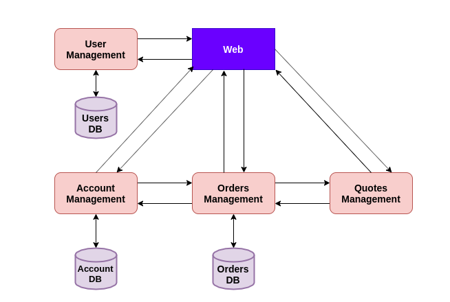

# CC-Project-Trading
Project for the subject of cloud computing.

## Description

In this project we are going to create an application in cloud for simulation in the stock exchange. This application will allow you to create purchase and sale orders in the market and record the current status of the portfolio.

For simplicity in this application all purchase and sale orders that are carried out will be executed at the closing market price and the collection of commissions for each order carried out will not be considered..

## Architecture

The application will be based on microservices. The microservices considered will be the following:

* **User management.** This microservice will be in charge of user management, allowing to register new users, users login, etc.
* **Account management.** This microservice manages the user's portfolio and user's stock market shares.
* **Quotes management.** This microservice is responsible for obtaining information on market quotations.
* **Order management.** This microservice is in charge of the management of purchase and sale orders. It has to communicate with the account management microservice to check if the user has enough cash to carry out the purchase order and also to update user portfolio and user's stock exchange shares. Also it needs to communicate with quotes management microservice to check the closing market price.

## Tools

The programming tools to be used have not yet been chosen.

## License

This project is under license [*GNU General Public License v3.0*](https://github.com/Solano96/CC-Project-Trading/blob/master/LICENSE).
