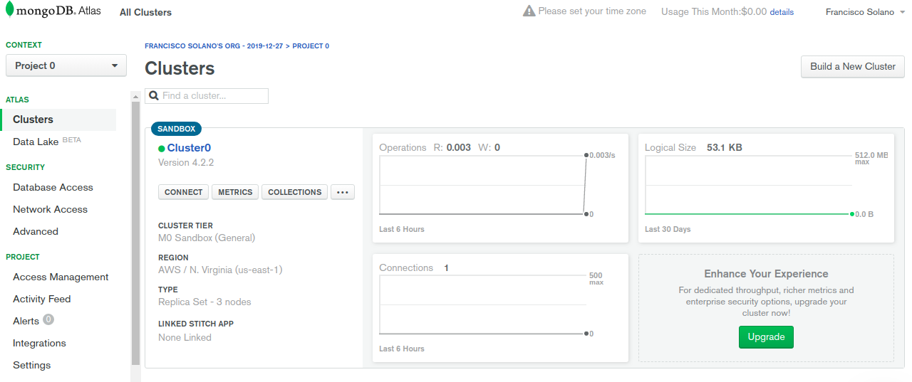
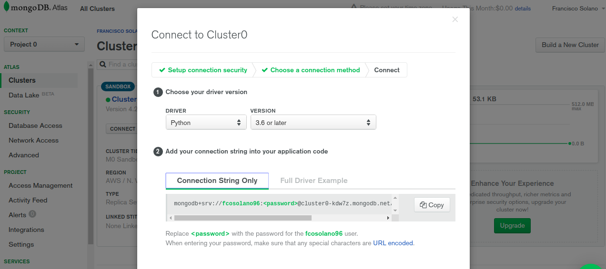
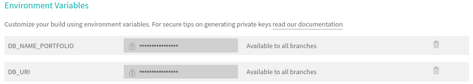
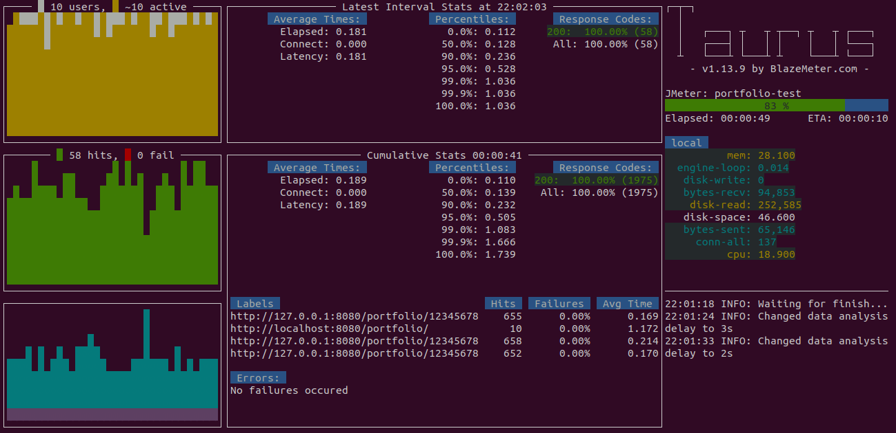
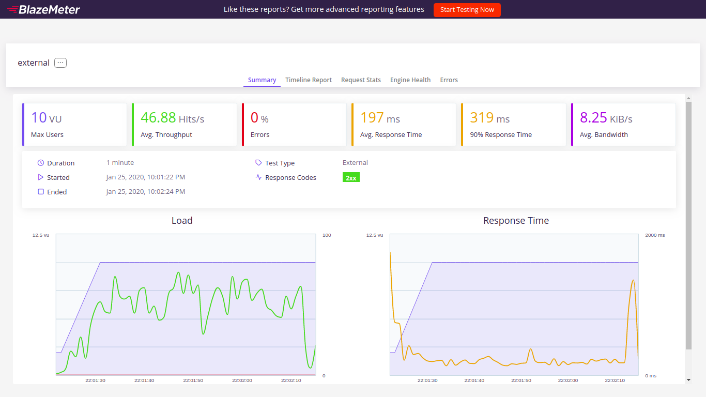
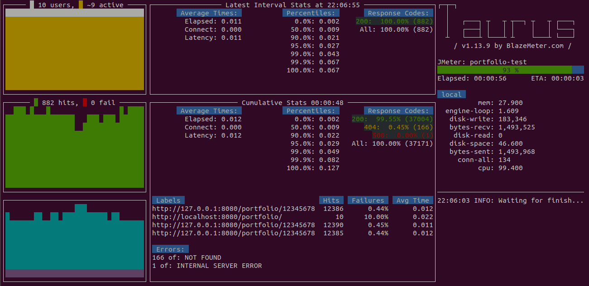
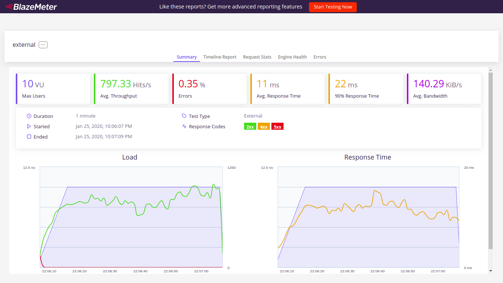
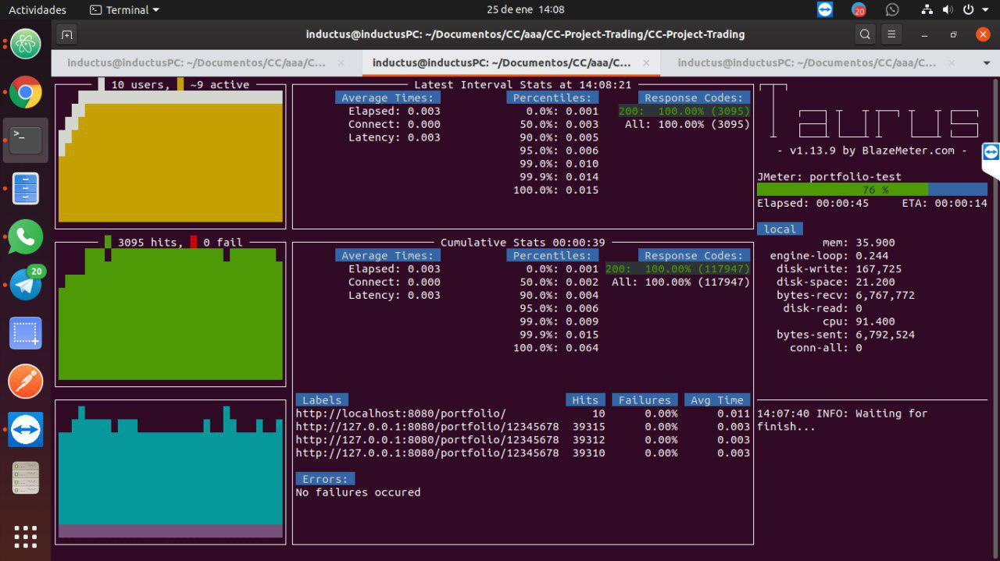
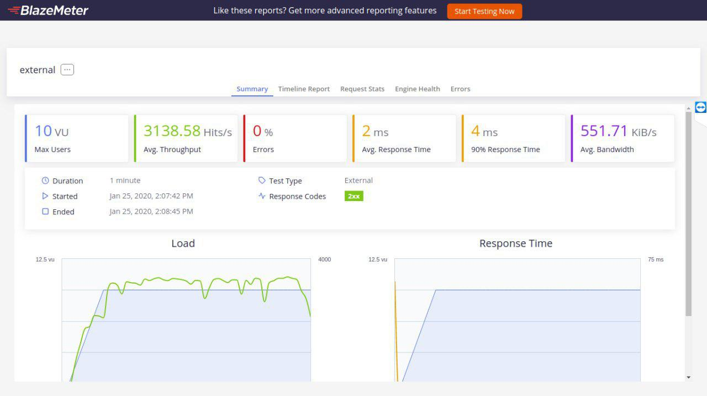

# Proyecto para la asignatura Cloud Computing

[](http://perso.crans.org/besson/LICENSE.html)
[](https://github.com/Solano96/CC-Project-Trading)
[](https://codecov.io/gh/Solano96/CC-Project-Trading)
[](http://cc-project-trading.herokuapp.com/)

## Descripción

En este proyecto se va a crear una aplicación desplegable en la nube, que sirva de simulador de bolsa.  Esta aplicación permitirá crear ordenes de compra y venta en el mercado y poder llevar un registro de la cartera del usuario.

## Arquitectura

La aplicación tendrá una arquitectura basada en microservicios. Para ver una descripción de la arquitectura en detalle se puede consultar el siguiente [enlace](https://solano96.github.io/CC-Project-Trading/docs/arquitectura).

## Tecnologías

El proyecto será realizado en el lenguaje de programación **Python**, para ver más información acerca de las tecnologías puede consultar el siguiente [enlace](https://solano96.github.io/CC-Project-Trading/docs/tecnologias).

## Herramientas de construcción

```
buildtool: tasks.py
```

Como herramienta de construcción se ha añadido el fichero [tasks.py](https://github.com/Solano96/CC-Project-Trading/blob/master/tasks.py), para el cual es necesario instalar el paquete de python invoke, esto se puede lograr con el siguiente comando:

```
$ pip install invoke
```

Una vez tengamos instalado dicho paquete, podremos hacer uso de las tareas definidas en el fichero tasks.py, para ello bastará con escribir el comando:

```
$ invoke <nombre-tarea>
```

Las tareas que se han definido son las siguientes:

* **install**: esta tarea se encarga de instalar todas las dependencias del proyecto, haciendo uso del fichero requirements.txt, en el cual se encuentran las librerías correspondientes, junto a la versión que se va a instalar.

* **test**: esta tarea se encarga de ejecutar los tests unitarios. Para ejecutar dichos tests se ha hecho uso de la librería [pytest](https://docs.pytest.org/en/latest/).

* **coverage**: esta tarea se encarga de ejecutar los tests de cobertura, haciendo uso del plugin [pytest-cov](https://pypi.org/project/pytest-cov/).

* **clean**: esta tarea se encarga de limpiar los archivos que se generan al ejecutar los test unitarios y los de cobertura.

* **start**: esta tarea se encarga de levantar el servidor. Como parámetros se pueden especificar el host, el puerto y el uri de la base de datos. Ejemplo:

	```
	$ invoke start --host=0.0.0.0 --port=9000 --db=0.0.0.0:27017
	```

* **stop**: esta tarea se encarga de parar el servidor.

## Integración continua

Se han utilizado dos herramientas de integración continua **Travis-CI** y **Github Actions**, cuya documentación puede encontrarse en este [enlace](https://solano96.github.io/CC-Project-Trading/docs/integracion_continua).


## Docker

La imagen de nuestro contenedor docker puede encontrarse en el siguiente enlace:

Contenedor: https://hub.docker.com/r/fcosolano96/cc-project-trading

Para ver mas detalles sobre el uso de Docker puedo consultar el siguiente [enlace](https://solano96.github.io/CC-Project-Trading/docs/docker).

## Heroku

Podemos comprobar que la imagen está desplegada en Heroku accediendo al siguiente enlace:

https://cc-project-trading.herokuapp.com

Para desplegar heroku se han seguido los pasos explicados en esta [guía](https://devcenter.heroku.com/articles/build-docker-images-heroku-yml). Mencionar que Heroku usa por defecto un puerto como variable de entorno, debido a ello hemos puesto el puerto en el dockerfile como variable de entorno. Adicionalmente he creado una base de datos en [MongoDB Atlas](https://www.mongodb.com/cloud/atlas) y posteriormente he añadido a Heroku la URI de dicha base de datos como variable de entorno, para lo cual he utilizado el comando `heroku config:set <VAR>=<VALUE>`.

## Base de datos

Para la base de datos se ha utilizado el sistema de base de datos MongoDB. Para hacer uso de la base de datos MongoDB podemos elegir entre 3 opciones, las cuales vamos a describir en los siguientes apartados.

#### Base de datos local

Esta primera opción consiste en instalar MongoDB en local y hacer uso de la base de datos instalada en nuestro propio equipo. Para la instalación de MongoDB en Ubuntu 18.04, podemos seguir los pasos de instalación que se encuentran en esta guía [instalación MongoDB](https://www.digitalocean.com/community/tutorials/como-instalar-mongodb-en-ubuntu-18-04-es).

#### Base de datos con Docker

Para esta opción podemos hacer uso del fichero docker-compose.yml, con el cual podemos ejecutar múltiples contenedores, definiendo la arquitectura de nuestra aplicación como servicios individuales. Los servicios se pueden conectar entre sí. En nuestro caso uno de los contenedores será creado a partir del Dockerfile y otro a partir de una imagen con MongoDB. El primer contenedor mencionado será el correspondiente a nuestro microservicio, el cual dependerá de mongodb ya que usa este como base de datos, esto se especificará en el fichero docker-compose.yml mediante el uso de la configuración ```depends_on```.

Para ver más detalles sobre la configuración del fichero docker-compose.yml, puede consultar el siguiente [enlace](https://github.com/Solano96/CC-Project-Trading/blob/master/docker-compose.yml).

#### Base de datos remota con MongoDB Atlas

Para poder hacer uso de la base de datos remota que nos proporciona [MongoDB Atlas](https://www.mongodb.com/cloud/atlas), deberemos crearnos en primer lugar, una cuenta en su página web. Tras registrarnos deberemos crear un cluster. Una vez tengamos lo anterior deberemos crear un usuario de la base de datos y después crear una base de datos con dicho usuario.



Por último para poder acceder a esta base de datos, deberemos obtener el uri accediento a Clusters > Connect > Connect your application, y copiar la cadena de texto que nos proporciona. Esta cadena deberemos usarla en la variable de entorno DB_URI y nos permitirá conectarnos a la base de datos remota que hemos creado. Como se puede ver en la imagen en la cadena que se nos proporciona, se debe sustituir password, por nuestra contraseña.



#### Usando MongoDB en los microservicios

Para que nuestros microservicios puedan interactuar con la base de datos en MongoDB desde Python, se va a utilizar PyMongo, una distribución de Python que contiene herramientas para trabajar con MongoDB. Para administrar la base de datos desde Python se ha creado una clase especifica que nos va a permitir realizar operaciones sobre la base de datos, dicha clase puede consultarse en el siguiente [enlace](https://github.com/Solano96/CC-Project-Trading/blob/master/src/Portfolio/portfolio_db.py). Se ha creado además otra clase que implementa la lógica del microservicio, a la cual se le inyecta directamente como atributo en el constructor, un objeto de la clase que administra la base de datos. De esta forma se consigue aplicar el patrón de inyección de dependencias, consiguiendo que la lógica del microservicio se despreocupe de como esté implementada la clase que accede a la base de datos.

La integración de la base de datos supone realizar algunos cambios en la integración continua, que vamos a mostrar a continuación:

- **Travis**: para que podamos acceder a la base de datos desde travis deberemos de añadir mongodb como servicio.

	```
	services:
	    - mongodb
	```

	Además deberemos de añadir la variable de entorno DB_URI lo cual se puede hacer añadiéndolas directamente en el fichero .travis.yml, pero si lo hacemos de esta forma estaremos mostrando públicamente los valores de nuestra variable de entorno. En lugar de ello lo que se ha hecho es añadirla desde la página de travis.

	

- **GitHub Actions**: al igual que se hizo en travis, deberemos de añadir mongodb como servicio. También deberemos de añadir la variable de entorno DB_URI, pero en vez de hacerlo directamente, podemos añadir en GitHub secretos encriptados, que podemos utilizar como variable de entorno cifrada. Para conseguir esto se han seguido los pasos de esta [guía](https://help.github.com/es/actions/automating-your-workflow-with-github-actions/creating-and-using-encrypted-secrets). Para utilizar este secreto encriptado como variable de entorno, se han añadido en el fichero las siguientes líneas:

	```
	env:
		DB_URI: ${{ secrets.DB_URI }}
	```


## Evaluación de prestaciones

Prestaciones: performance_test.yml

#### Prueba 1

La primera prueba ha sido realizada en local, con el





#### Prueba 2





#### Prueba 3




