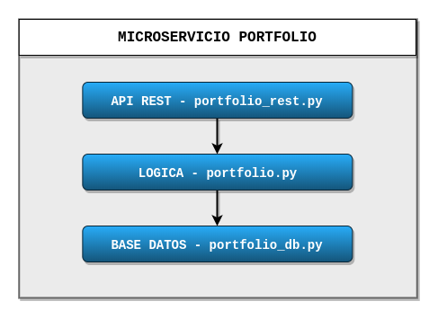
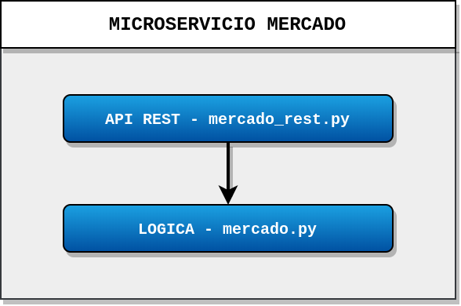

## Arquitectura

La aplicación tendrá una arquitectura basada en microservicios, lo cual nos permitirá implementar los diferentes servicios de forma independiente y despleglarlos por separado.

A continuación se exponen las entidades del sistema y cada una de las cuales se corresponderá con un microservicio.

* `Portfolio`. Un portfolio en bolsa es una agrupación de activos financieros, en nuestro proyecto tan solo estará formado por el saldo disponible y las acciones compradas. Las funcionalidades de esta entidad son las siguientes:

	* Creación de un nuevo portfolio.
	* Dar de baja un portfolio.
	* Consultar el saldo disponible en un portfolio.
	* Modificar saldo de un portfolio.
	* Consultar acciones compradas en un porfolio.
	* Comprar acciones
	* Vender acciones.

* `Mercado`. Esta entidad está formada por el nombre del mercado y la información de la cotización del mercado, está incluye el precio de apertura, cierre, mínimo y máximo, además del volumen del periodo. También se incluye la fecha y hora en la que se actualizó las información. Las funcionalidades son las siguientes:

	* Consultar el precio de cierre/apertura/mínimo/máximo de un mercado.
	* Consultar el volumen de un mercado.
	* Consultar la hora de la última actualización de un mercado.
	* Actualizar información de la cotización de un mercado. Esta funcionalidad se ejecutará de manera interna cada minuto.

Para comunicarse con los microservicios se dispondrá de un API Gateway. Cada microservicio implementará un API Rest y además cada uno tendrá su propia base de datos. También se dispondrá de un servicio de LOG centralizado y otro de configuración distribuida.

En la siguiente ilustración podemos ver un diagrama de la arquitectura.

#### Arquitectura por capas

* **Microservicio Portfolio**

	Este microservicio se ha implementado siguiendo una estructura por capas. La primera capa de este microservicio se encarga de administrar la base de datos Portfolio, permitiendo realizar operaciones sobre dicha base de datos y facilitando la implementación de la segunda capa. La segunda capa se encarga de administrar la lógica del microservicio, aportando funcionalidades que permiten por ejemplo ingresar o retirar saldo de la cuenta o comprar y vender acciones. La última capa implementa el api rest, definiendo las rutas que nos permiten realizar peticiones al microservicio.

	En la siguiente ilustración se muestra lo que se acaba de describir, para que se vea de forma más clara.

	

	Las rutas definidas en el API REST Portfolio son las siguientes:

	1. **/portfolio** (GET): ruta inicial con la que podemos comprobar que el microservicio está en funcionamiento y devueve lo siguiente: `{'Microservicio': 'Portfolio'}`.

	2. **/portfolio/< dni >** (GET): esta ruta devuelve información básica acerca del usuario con dicho dni y puede servir para comprobar que funciona el acceso a la base de datos y además que dicho usuario está registrado.

		Ejemplo: `{"dni":"00000000A","nombre":"Francisco"}`

	3. **/portfolio/< dni >/saldo** (GET): mediante esta petición podemos obtener el saldo en la cuenta.

		Ejemplo: `{"saldo":45.0}`

	4. **/portfolio/< dni >/acciones** (GET): mediante esta petición podemos obtener las acciones de las que disponemos en la cuenta.

		Ejemplo: `{"acciones":{"AAPL":10,"SAN":20}}`

	5. **/portfolio/< dni >/acciones/< mercado >** (GET): mediante esta petición podemos obtener las acciones de las que disponemos en la cuenta de un determinado mercado.

		Ejemplo: `{"AAPL":10}`

	6. **/portfolio/< dni >/ingresar-saldo** o **/portfolio/< dni >/retirar-saldo** (POST): con esta petición POST podemos ingresar saldo o retirarlo de la cuenta asociada.

	7. **/portfolio/< dni >/comprar-acciones** o **/portfolio/< dni >/vender-acciones** (POST): con esta petición POST podemos comprar o vender acciones con la cuenta asociada al dni.

* **Microservicio Mercado**

	Este microservicio, al igual que el anterior, está implementado siguiendo una arquitectura por capas. En este caso se tienen 2 capas, una de ella implementa la lógica del microservicio y por otro lado tenemos el API REST, que hace uso de la capa anterior. En la siguiente ilustración se puede ver dicha estructura.

	

	Las rutas definidas en el API REST Mercado son las siguientes:

	1. **/quote** (GET): ruta inicial con la que podemos comprobar que el microservicio está en funcionamiento y devueve lo siguiente: `{'Microservicio': 'Mercado'}`.

	2. **/quote/<symbol>** (GET): esta ruta devuelve un histórico de datos del mercado especificado que se especifique.

	3. **/quote/realtime/<symbol>** (GET): esta ruta devuelve información en tiempo real del mercado que se especifique.
