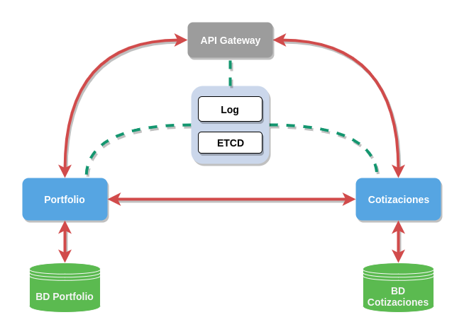

## Arquitectura

La aplicación tendrá una arquitectura basada en microservicios, lo cual nos permitirá implementar los diferentes servicios de forma independiente y despleglarlos por separado.

A continuación se exponen las entidades del sistema y cada una de las cuales se corresponderá con un microservicio.

* `Portfolio`. Un portfolio en bolsa es una agrupación de activos financieros, en nuestro proyecto tan solo estará formado por el saldo disponible y las acciones compradas. Las funcionalidades de esta entidad son las siguientes:

	* Creación de un nuevo portfolio.
	* Dar de baja un portfolio.
	* Consultar el saldo disponible en un portfolio.
	* Modificar saldo de un portfolio.
	* Consultar acciones compradas en un porfolio.
	* Comprar acciones
	* Vender acciones.

* `Mercado`. Esta entidad está formada por el nombre del mercado y la información de la cotización del mercado, está incluye el precio de apertura, cierre, mínimo y máximo, además del volumen del periodo. También se incluye la fecha y hora en la que se actualizó las información. Las funcionalidades son las siguientes:

	* Consultar el precio de cierre/apertura/mínimo/máximo de un mercado.
	* Consultar el volumen de un mercado.
	* Consultar la hora de la última actualización de un mercado.
	* Actualizar información de la cotización de un mercado. Esta funcionalidad se ejecutará de manera interna cada minuto.

Para comunicarse con los microservicios se dispondrá de un API Gateway. Cada microservicio implementará un API Rest y además cada uno tendrá su propia base de datos. También se dispondrá de un servicio de LOG centralizado y otro de configuración distribuida.

En la siguiente ilustración podemos ver un diagrama de la arquitectura.

