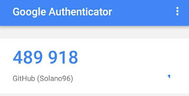

## Configurar correctamente el entorno

* Descarga de **git** para usarlo desde la línea de órdenes.

		sudo apt update
		sudo apt install git

	Para ver la versión instalada:

		git --version

	Salida: ```git version 2.17.1```

* Creación de par de claves y subida de clave pública a GitHub.

	En el terminal ejecutamos los siguientes comandos:

		ssh-keygen -t rsa -b 4096 -C "fransol0728@gmail.com"
		eval "$(ssh-agent -s)"
		ssh-add ~/.ssh/id_rsa

	Una vez hecho lo anterior ejecutamos el comando ```cat ~/.ssh/id_rsa.pub ``` y copiamos el resultado.

	A continuación en Github vamos a *Settings -> SSH keys and GPG keys*, hacemos click en *New SSH key* y pegamos en el cuadro de texto que podemos ver en la siguiente ilustración el contenido que habíamos copiado.

	

	Una vez añadida la clave SSH podremos ver esta en la lista de nuestras claves SSH asociadas a la cuenta.

	

* Configuración correcta del nombre y correo electrónico para que aparezca en los commits.

		git config --global user.name "Solano96"
		git config --global user.mail "fransol0728@gmail.com"

* Edición del perfil de GitHub para que aparezca una imagen en vez del avatar por omisión, nombre completo y ciudad, así como universidad.

	

* Incrementar la seguridad de nuestra cuenta en GitHub activando el segundo factor de autenticación.

	Para activar el segundo factor de autenticación deberemos de ir a *Settings -> Security -> Two-factor authentication*.

	Una vez lo activemos tras ingresar nuestro usuario y contraseña para iniciar sesión nos pedirá una código de autenticación.

	

	En mi caso utilizo la aplicación **Google Authenticator** para obtener el código. Para sincronizalo a nuestra cuenta deberemos previamente escanear el código QR que nos proporciona Github.

	
